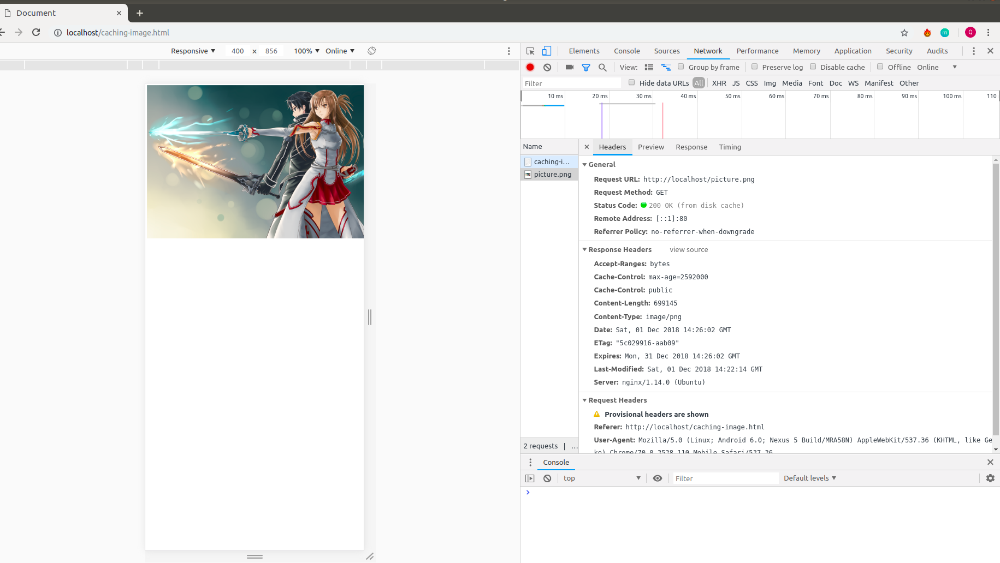

# Caching

#### Vai trò của caching :

Cache là một bộ nhớ có kích thước nhỏ nhưng có khả năng truy xuất nhanh dùng để lưu trữ các dữ liệu của phiên hoạt động gần nhất hoặc thường xuyên được truy cập là nơi khi tìm kiếm dữ liệu sẽ đươc xem xét đầu tiên nếu có thì trả về nếu không sẽ truy cập database để tìm kiếm.

##### Các loại caching :
    - Client caching
    - Application caching
    - CDN caching
    - Web server caching
    - Database caching

#### Các thuật toán apply cho caching :
Cache được lưu trên RAM do đó vùng nhớ bị hạn chế  nên chỉ lưu trữ được một phần nhỏ thông tin của hệ thống, do đó cần phải có chiến lược thay thế thông tin cũ để nhường chỗ cho những thông tin mới phù hợp hơn, Các thuật toán apply trên cache được sinh ra để giải quyết vấn đề này.
- LRU (Least Recently Used) : ý tưởng của thuật toán này là sử dụng 'age bits', mỗi khi có yêu cầu truy xuất thì sẽ có 2 trường hợp sau đây :
    - Trường hợp 1 : thông tin muốn truy xuất có trong cache thì phần tử chứa thông tin cần tìm sẽ được hiểu chỉnh lại `age bits` sao cho nhỏ nhất các phần tử khác `age bits` sẽ tăng thêm 1.
    - Trường hợp 2 : thông tin muốn truy xuất không có trong cache thì request sẽ được đưa xuống database search sau đó khí tìm được phần tử có age bits lớn nhất sẽ bị loại bỏ thế chỗ cho nó là phần từ vừa tìm và đưa lên từ database các phần tử còn lại trong cache age bit tăng 1.


- LFU (Least Frequently Used) : cách làm của thuật toán này là tìm ra phần tử có số lần được gọi đến nhỏ nhất trong cache. Nếu 1 request tới :
    - Trường hợp 1 : có trong mảng biến tần số của phần tử đó sẽ tăng lên 1.
    - Trường hợp 2 : không có trong mảng phần tử có biến tần số nhỏ nhất sẽ bị loại thay vào đó phần tử mới cần tìm được gán biến tần số bằng 1.


#### Cài đặt nginx để phục vụ trang web tĩnh (trang web có hiển thị một bức ảnh).
Đầu tiên chúng ta phải có quyền root để chỉnh sửa các file thuộc root

```
sudo nautilus /
```

Tại terminal 
```
cd /var/www/html
```

Sau đó tạo thư mục là caching-image.html để chứa ảnh trong đó.

Sau khi tạo file dùng nano hoặc vim để thêm đoạn code sau vào file.

```
<!DOCTYPE html>
<html lang="en">
<head>
    <meta charset="UTF-8">
    <meta name="viewport" content="width=device-width, initial-scale=1.0">
    <meta http-equiv="X-UA-Compatible" content="ie=edge">
    <title>Document</title>
</head>
<body>
    
</body>
</html>
```

Sau đó vào /etc/nginx/sites-available và chỉnh sửa nội dung file defaults như sau :
```
server {
        listen 80 default_server;
        listen [::]:80 default_server;

        root /var/www/html;
        index index.html index.htm index.nginx-debian.html;

        server_name _;

        # Media: images, icons, video, audio, HTC
        location ~* \.(?:jpg|jpeg|gif|png|ico|cur|gz|svg|svgz|mp4|ogg|ogv|webm|htc)$ {
            expires 1M;
            access_log off;
            add_header Cache-Control "public";
        }
        ####

        location / {
                try_files $uri $uri/ =404;
        }
}
```
#### Kết quả thu được :
 vào trang http://localhost/caching-image.html sau đó refresh lại check lại bằng developer tools của google.

 