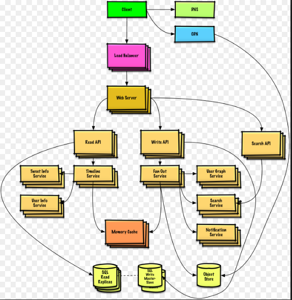

# System Design Primer 

# Định lý CAP, khái niệm `eventual consistency`.

## Định lý CAP.

 CAP là viết tắt của Consistency, Availability, Partition Fault, Tolerance, trong đó :

 - Consistency ( Tính nhất quán ) : tất cả các node trong hệ thống phải có dữ liệu đồng nhất với nhau.

 - Availability ( Tính sẵn sàng ) : tính sẵn sàng hoạt động của toàn hệ thống.Hệ thống vẫn hoạt động được khi một số node chết.

 - Partition Fault Tolerance ( Phân vùng ) : hệ thống vẫn hoạt động bất chấp việc kết nối giữa các node gặp trục trặc.

 Có 3 loại khác nhau :
- CP ( Consistency and Partion Tolerance ) : khó có thể tồn tại trong thực tế.
- CA ( Consistency and Availability ) : một instance không liên quan gì đến lỗi mạng trong cụm.
- AP (Availability and Partition Tolerant ) : một hệ thống luôn sẵn sàng và vẫn hoạt động khi gặp trục trặc nhưng không đảm bảo tính nhất quán của dữ liệu.

Thông thường AP là một sự lựa chọn tốt cho hệ thống nó sẽ trả về kết quả của bản dữ liệu gần nhất hoặc không cho phép tính chất 'eventual consistency' hoặc hệ thống gập lỗi.
### Eventual consistency : Hệ thống đảm bảo rằng nếu không có thêm cập nhật nào nữa, thì cuối cùng tất cả các truy nhập sẽ trả về giá trị cập nhật cuối cùng. Nếu không có trục trặc nào xảy ra, quãng thời gian lớn nhất của inconsistency window có thể được xác định dựa trên các yếu tố như độ trễ đường truyền, tải của hệ thống, và số bản sao dữ liệu được nhân bản. 

# Khái niệm throughput, latency.

- ## Throughput : số lượng tác vụ trong một đơn vị thời gian.
- ## Latency : thời gian từ khi bắt đầu thực hiện một tác vụ cho đến khi cho ra được kết quả của tác vụ đó.

Khi viết ra một hệ thống phải đảm bảo thời gian throughput và latency ở mức chấp nhận được.
# Các phương pháp để scale database (MySQL): sharding, replication, ...

- ## Sharding : Sharding là một tiến trình lưu giữ các bản ghi dữ liệu qua nhiều thiết bị để đáp ứng yêu cầu về sự gia tăng dữ liệu. Khi kích cỡ của dữ liệu tăng lên, một thiết bị đơn ( 1 database hay 1 bảng) không thể đủ để lưu giữ dữ liệu. Sharding giải quyết vấn đề này với việc mở rộng phạm vi theo bề ngang (horizontal scaling). Với Sharding, bạn bổ sung thêm nhiều thiết bị để hỗ trợ cho việc gia tăng dữ liệu và các yêu cầu của các hoạt động đọc và ghi.
- ## Replication : là một cách sao lưu dữ liệu thành nhiều bản khác nhau và sẽ được lưu trữ trên nhiều node khác nhau mục đích là giúp giảm tải và mở rộng cho hệ thống có khả năng recovery lại được dữ liệu khi có sự cố xảy ra.
Hiện nay có 2 kiểu sao lưu replicate chính là : master - slave và master - master .

### Master - Slave 
Master - Slave được sử dụng trong các bài toán liên quan tới việc cải thiện hiệu suất performance, hỗ trợ backup các database khác nhau. Mô hình này cho phép từ một cơ sở dữ liệu database master có thể replica dữ liệu của nó tới một hay nhiều slave khác trong hệ thống. Master sẽ ghi lại các lần nó gửi các bản cập nhật tới cho slave, sau đó đem các bản ghi lại đó gửi tiếp cho các slave các slave căn cứ vào đó để biết rằng là đã cập nhật lần cuối cùng và chờ đợi các bản cập nhật tiếp theo.

### Master - Master
Master - Master hay còn gọi là multi master replication là phương pháp replication cho phép dữ liệu được lưu trữ bởi một cụm các máy tính và dữ liệu được lưu sẽ được cập nhật bởi bất kỳ thành viên nào trong nhóm đó. Tất cả các master đều đáp ứng các yêu cầu truy vấn dữ liệu hệ thống multi master có trách nhiệm loan sự thay đổi ra khắp các thành viên trong nhóm vá xử lý các xung đột giữa các thành viên trong nhóm.
Mô hình multi master cũng có điểm giống master slave ở chỗ  các master cũng sẽ lựa ra một master lớn nhất các node khác muốn cập nhật dữ liệu phải liên lạc và có sự cho phép của node master lớn nhất này.Mục đích chính của multi master là tăng tính khả dụng và thời gian phản hồi của máy chủ.

# Task Queue khác gì Message Queue?
- Task queue : nhận vào các process và các data liên quan chạy và trả về kết quả. Hỗ trợ scheduling, hỗ trợ xử lý tác vụ handling task background.

- Message queue : nhận giữ và phân chia các message nếu như có một task bất kỳ trở nên chậm trong việc xử lý các message đồng bộ, thì ta có thể  sử dụng các sau : 

    1 > Đưa việc cần xử lý vào queue và thông báo trạng thái của queue đến cho user.

    2 > Các worker sẽ tìm các bắt các công việc từ queue xử lý và thông báo cong6 việc đã được hoàn thành.

    Công việc sẽ được thực hiện dưới nền, trong lúc chờ đợi công việc được hoàn thành client tương đối rãnh nên nó có thể thực hiện một số việc như là xem lại các việc đã hoàn thành trước đó.
    