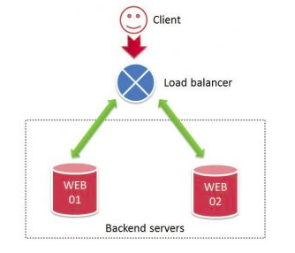
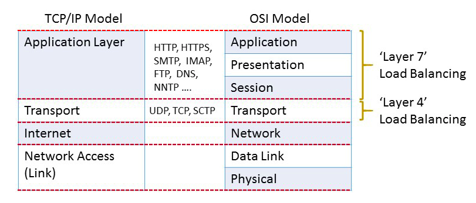
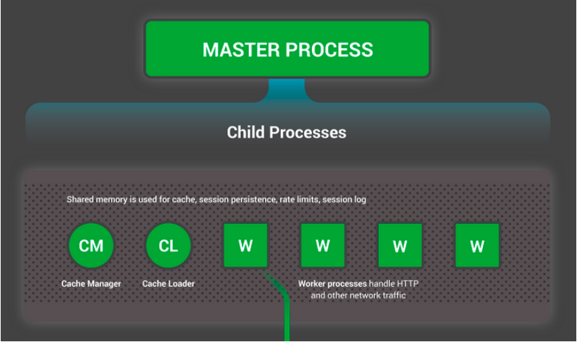
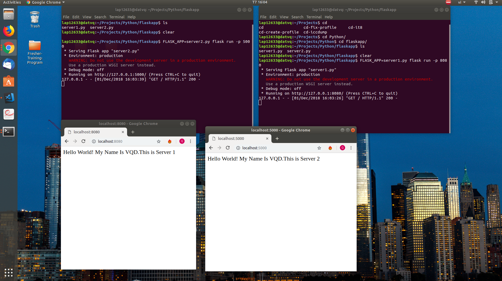

# Load-Balancer
Khái niệm về load balancer : load balancer thực chất là một hệ thống ( bao gồm cả phần cứng hoặc phần mềm ) giúp điều tiết (traffic cop) các request từ phía người dùng khi các request này tăng lên một cách đột ngột và bất thường khi có 1 lượng lớn các incoming request tới một trang web hay đúng hơn là request data từ các backend server phía sau trang web đó.
Load balancer sẽ giúp cho hệ thống :
- Ngăn được request tới các tài nguyên đang bị quá tải.
- Sẽ không xảy ra việc một tài nguyên bị down mà dẫn đến sụp cả hệ thống.
- Dễ dàng scale out cho hệ thống.
- Tăng khả năng response và availability cho hệ thống.

        
    

Có 2 cách để load balancer là thực hiện bằng hardware hoặc software :

- Cách dùng hard-ware là các thiết bị chuyên dụng, các mạch điều hướng trong thiết bị được thiết kế tối ưu cho việc điều hướng nên cách này có thể gọi là tốt nhất cho load balancer. Tuy nhiên, chi phí thường không nhỏ và khả năng tùy biến không lớn.

- Cách thứ hai là sử dụng các software và cài đặt lên các server trong mạng và làm nhiệm vụ điều hướng tới các server được chỉ định trong mạng khi có truy vấn từ ngoài mạng. Cách này hiện được ưa chuộng hơn bởi không cần mua các thiết bị đắt đỏ và có thể tùy chỉnh hệ thống vì hầu hết là phần mềm mã nguồn mở.(Hiện nay ông lớn về dịch vụ server là Amazon Web Service(AWS) đã có cung cấp dịch vụ LB cho các nhà phát triển được gọi là Elastic Load Balancer ).

## Các loại balancer :
- Layer 4 load balancing : sẽ xử lý các dữ liệu tìm thấy tại tầng Transport. Dựa trên các thông tin trả vể tại tầng transport để quyết định phân phối các request nhìn chung liên quan đến source,địa chỉ IP và port.
- Layer 7 load balancing : sẽ xử lý các dữ liệu tại tầng Application
(Tính theo mô hình TCP/IP).Khi layer 7 chạy nó sẽ chấm dứt tạm thời các đường mạng xem xét lại dữ liệu đưa ra các quyết định cân bằng sau đó mới mở các kết nối mới tới máy chủ đã chọn.




### Load balancing algorithms

Mục đích để xác định sử dụng tài nguyên nào trong nhiều tài nguyên mà hệ thống đang có. Có một vài điều cần quan tâm:

- Round robin: là một phương pháp đơn giản trong việc load balance hay tăng khả năng chịu lỗi của hệ thống một cụm các máy chủ được cấu hình để có thể cung cấp các dịch vụ giống y như nhau được cấu hình để cùng sử dụng chung một virtual IP nhưng trong nội bô với nhau mỗi máy chủ đó có một IP thật duy nhất. Máy chủ DNS sẽ có danh sách tất cả IP thật đó khí có yêu cầu liên kết với Internet các request đó được trả về xử lý luân phiên tuần tự đến cho từng máy chủ.

- Weighted round robin: dựa trên Round robin, nhưng có thêm biến để lưu trọng số ưu tiên tức là các máy chủ sẽ được đánh số ưu tiên máy chủ nào có trọng số ưu tiên cao hơn thì máy đó sẽ nhận lượng request nhiều hơn.

- Least connection: cả 2 phương pháp trên đều không tính đến việc là các máy chủ đang xử lý khối lượng công việc như thế nào.Phương pháp least connection áp dụng điều này trong việc điều phối cân bằng tải request sẽ đưa đẩy tới cho server nào tại thời điểm đang xét có lương công việc xử lý là ít hơn so với các server khác.

Tham khảo : 
- [https://kemptechnologies.com/load-balancer/load-balancing-algorithms-techniques/]
----------------------------------------------------------------------

# NGINX
 
 NGINX là gì ?
 - NGINX là phần mềm mã nguồn mở (open source) là một web server  có thể được sử dụng như một reverse proxy, load balancer, HTTP cache.

- Không giống với các máy chủ web truyền thống, Nginx không dựa trên luồn (thread) để xử lý yêu cầu. Thay vào đó, nó sử dụng 1 kiến trúc bất đồng bộ hướng sự kiện linh hoạt . Kiến trúc này sử dụng ít, nhưng quan trọng hợn, là lượng bộ nhớ có thể dự đoán khi hoạt động. Đây chính là điểm mấu chốt khiến Nginx là 1 trong số ít những máy chủ được viết để giải quyết vấn đề C10K.

- C10K là gì ? Hiểu đơn giản thì do các máy chủ web truyền thống xử lý các yêu cầu dựa trên luồn (thread), tức là mỗi khi máy chủ web nhận được 1 yêu cầu mới, nó sẽ tạo ra 1 luồng mới để xử lý cho yêu cầu này, và cứ thế khi số lượng các yêu cầu gửi đến máy chủ web ngày càng nhiều thì số lượng các luồn xử lý này trong máy chủ sẽ ngày càng tăng. Và điều này dẫn đến việc thiếu hụt tài nguyên cấp cho các luồn xử lý trên ... 

Kiến trúc bên trong NGINX :
 - Master process : tiến trình này không chịu trách nhiệm tự xử lý bất kỳ process nào từ phía client mà chỉ nhận xử lý các tiến trình đặc thù như đọc configuration, binding port và sau đó tạo ra các child process.

 - Cache loader : được khởi chạy từ lúc bắt đầu  để tải dung lượng từ memory cached vào trong memory và sau đó sẽ thoát ra quy trình này được thiết kế rất tỉ mỉ vì thế nhu câu sử dụng tài nguyên thấp.

 - Cache manager : process chạy định kỳ mục đích quản lý nội dung trong cache. 

 - Worker proccess : làm tất cả các công việc còn lại xử lý các kết nối đọc và ghi dữ liệu và giao tiếp với các máy chủ.

 


## Tại sao NGINX sử dung single thread 

- Không tốn nhiều tài nguyên về hardware.
- Không tốn thời gian context switch.
- Dùng non-blocking xử lý thread vì vậy trong quá trình xử lý thread này sẽ không làm ảnh hưởng thread khác.

## Bài tập 
Bài tập yêu cầu dùng python để xây dựng web đơn giản.

Sử dụng python kết hợp với flask xem tutorial cài đặt trên google.

Sau khi cài đặt xong chúng ta tạo 2 file .py ví dụ server1.py và server2.py với nội dung như sau :

```
from flask import Flask
app = Flask(__name__)

@app.route("/")
def hello():
    return "Hello World! My Name Is VQD"


if __name__ == '__main__' :
	app.run(debug=True)
	
```

Link: [exercises-loadbalancing](./Load-Balancer/Code)

Cho 2 server chạy trên 2 port khác nhau tại terminal ta gõ các chuỗi lệnh sau :

```
FLASK_APP=server1.py flask run -p 5000
FLASK_APP=server1.py flask run -p 8080
```
Mở 

https://127.0.0.1:5000/ và https://127.0.0.1:8080 hoặc

localhost:5000 và localhost:8080 để có thể xem kết quả.


##  ***** Cài đặt load balancing với NGINX *****
Tại terminal :
 sudo apt-get update
 sudo apt-get install nginx


Dùng quyền root để sủa file tại terminal :
```
sudo nautilus /
```
Cấu hình bằng cách thay đổi nội dung lại file `default` ở `/etc/nginx/sites-available`.

```
upstream localhost {
	server localhost:5000;
	server localhost:8080;
}

server {
	listen 80;
	location / {
		proxy_pass http://localhost;
	}
}
```
### Thu được kết quả như sau :


