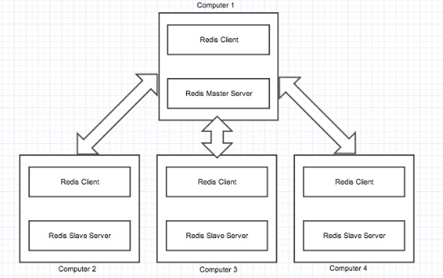
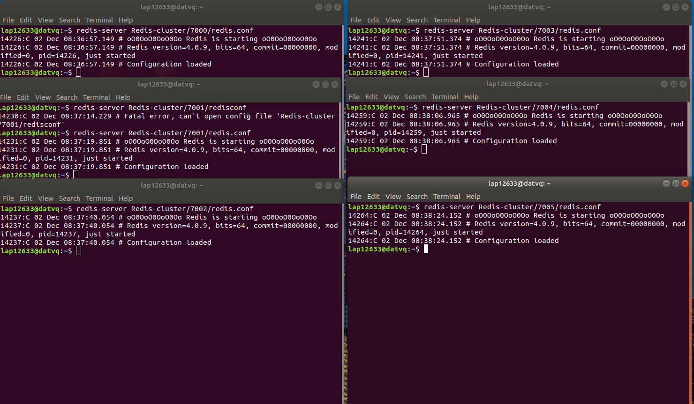
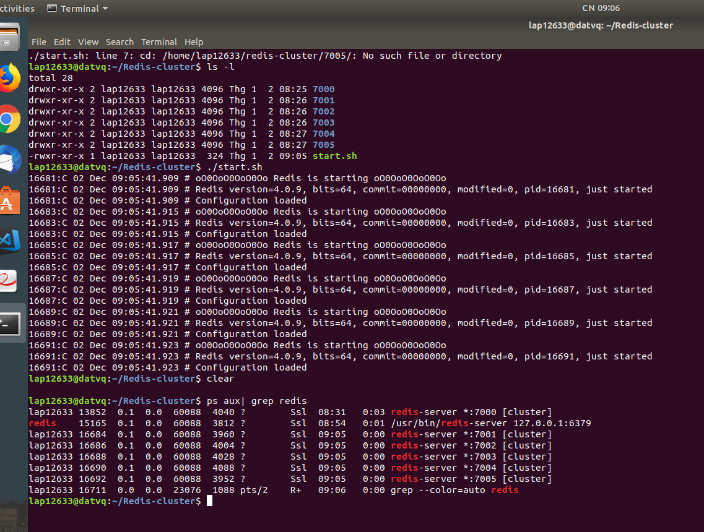

# Khái niệm cơ bản về redis :

## Khái niệm :
Redis là hệ thống lưu trữ key-value với rất nhiều tính năng và được sử dụng rộng rãi. Redis nổi bật bởi việc hỗ trợ nhiều cấu trúc dữ liệu cơ bản (hash, list, set, sorted set, string), đồng thời cho phép scripting bằng ngôn ngữ lua. Bên cạnh lưu trữ key-value trên RAM với hiệu năng cao, redis còn hỗ trợ lưu trữ dữ liệu trên đĩa cứng (persistent redis) cho phép phục hồi dữ liệu khi gặp sự cố. Ngoài tính năng replicatation (sao chép giữa master-client), tính năng cluster (sao lưu master-master) cũng đang được phát triển.

## Kiến trúc của redis :

Kiến trúc redis bao gồm redis client và redis server có thể đặt cùng hoặc khác máy với nhau đều được.

- Redis Server : có nhiệm vụ là lưu trữ dữ liệu, quản lý chung và là một thành phần quan trọng của kiến trúc.
- Redis clients : có thể là redis client console hoặc các redis API hỗ trỡ cho các ngôn ngữ lập trình.

Redis lưu trữ dữ liệu trên RAM nhưng lưu trên RAM thì sẽ sinh ra các vấn đề về dung lượng và dĩ nhiên nếu bị mất điện đột ngột thì chương trình sẽ mất hết dữ liệu do đó cơ chế REDIS Persistence được ra đời

### Redis Persistance :

Mặc dù làm việc với data dạng key-value lưu trữ trên RAM, Redis vẫn cần lưu trữ dữ liệu trên ổ cứng. Có 2 lý do cho việc này, 1 là để đảm bảo toàn vẹn dữ liệu khi có sự cố xảy ra (server bị tắt nguồn) cũng như tái tạo lại dataset khi restart server, 2 là để gửi data đến các slave server, phục vụ cho tính năng replication. Redis cung cấp 2 phương thức chính cho việc sao lưu dữ liệu ra ổ cứng, đó là RDB và AOF

- RDB (Redis DataBase file) :  RDB thực hiện tạo và sao lưu snapshot của DB vào ổ cứng sau mỗi khoảng thời gian nhất định..
- AOF (Append Only File) : AOF lưu lại tất cả các thao tác write mà server nhận được, các thao tác này sẽ được chạy lại khi restart server hoặc tái thiết lập dataset ban đầu.

### Redis Replication :

Là kỹ thuật cho phép các máy tính có thể chia sẻ tài nguyên với nhau và vì đã share tài nguyên với nhau khi có 1 vài node trong mạng bị down chúng ta vẫn sẽ có data đáp ứng cho user.

Trong Redis, thông thường một node sẽ được phân làm master server, các node còn lại sẽ là slave server.  

Tất cả các queries như read hoặc write sẽ được gửi tới master. Khi có yêu cầu write data master server sẽ ghi xuống bộ nhớ của nó, sau đó sẽ sao chép dữ liệu đó qua cho các slave server. Khi có một số lượng lớn yêu cầu reads tại một thời điểm, master server sẽ phân phối request này tới các slave server.

Trong trường hợp một slave down, hệ thống tiếp tục hoạt động.

Trong trong trường hợp master server down hệ thống sẽ bổ nhiệm một slave lên làm master. 



### Clustering in Redis :

Đây là kĩ thuật mà dữ liệu được phân tách cho mỗi máy. Ưu điểm là có thêm nhiều dữ liệu được lưu trữ nhờ sự kết hợp của nhiều nodes

Mỗi node trong cluster sử dụng 2 kết nối TCP ưngs với 2 port, port thứ nhất dùng để giao tiếp với client, port thứ 2 bằng số port thứ nhất +10000, port này dùng để giao tiếp với các node khác (high port)

Trong mỗi cluster có 16384 hash slots.
Ví dụ, một cluster có 3 node A, B, C mà trong đó:
Node A contains hash slots from 0 to 5500.
Node B contains hash slots from 5501 to 11000.
Node C contains hash slots from 11001 to 16383.

Phương pháp trên gọi là <b> Redis Cluster data sharding</b>

Tuy nhiên, ở mô hình trên nếu node B down, thì khoảng vùng hash slot từ 5501-11000 sẽ không được phục vụ.

Để duy trì tính khả dụng của hệ thống khi có bất kì một node nào down,thì ta sử dụng <b>Redis Cluster master-slave model</b>. Model này sử dụng một master với một slave trên một node, dữ liệu trên master sẽ được sao chép cho slave, khi một master của một node down, slave sẽ được ủy quyền xử lý thay cho master. 

### Cách đặt tên keys cho phù hợp:
- Không nên đặt tên key dài, bởi vì việc lookup key trong dataset sẽ tốn chi phí cao cho tác vụ so sánh.
- Cố gắng đặt tên key ngắn, vì khi số lượng key nhiều, thì dữ liệu lưu trữ cũng tăng lên đáng kể.
- Cũng không nên đặt tên key quá ngắn vì khó gợi nhớ, chẳng hạn "u1000flw" nên thay bằng  "user:1000:followers".
- Nên đặt tên theo schema theo fortmat "object-type:id" ví dụ "user:1000".
- Maximum của key size là 512MB.

### Config cluster redis 3 node, chạy cùng machine, khác port:
Xem cách cài đặt redis trên google.

- Tạo 3 node, mỗi node gồm 1 master và 1 slave, tạo 6 file config trong 6 thư mục từ 7000 đến 7005

```
$ mkdir 7000 7001 7002 7003 7004 7005
$ touch 7000/redis.conf  
```
- Trong mỗi file conf, có nội dung tương tự như sau,(khác nhau tên port)

```
port <port number>
cluster-enabled yes
daemonize yes
cluster-config-file nodes.conf
cluster-node-timeout 5000
appendonly yes
```
 Gõ 6 lần command :
```
redis-server Redis-cluster/7000/redis.conf
redis-server Redis-cluster/7001/redis.conf
redis-server Redis-cluster/7002/redis.conf
redis-server Redis-cluster/7003/redis.conf
redis-server Redis-cluster/7004/redis.conf
redis-server Redis-cluster/7005/redis.conf
```




Dùng ps aux | grep redis để kiem tra xem các server đang chạy.




- Install Ruby và gõ lệnh:

```
$ gem install redis
```
- Tạo cluster :
< Đối với redis 4 và 3 thì gõ lệnh này >

```
$ redis-trib.rb create --replicas 1 127.0.0.1:7000 127.0.0.1:7001 127.0.0.1:7002 127.0.0.1:7003 127.0.0.1:7004 127.0.0.1:7005
```

- Bật redis-cli để kiểm tra, chỉ thị -c để redis-cli tự động chuyển cửa sổ sang cli bên port khác.

```
$ redis-cli -p 7000 -c
```