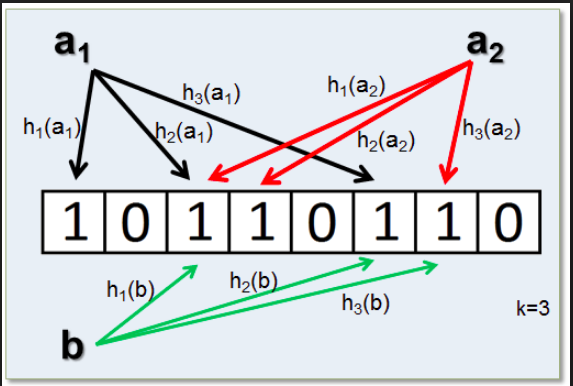
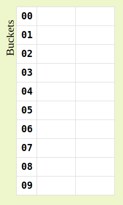
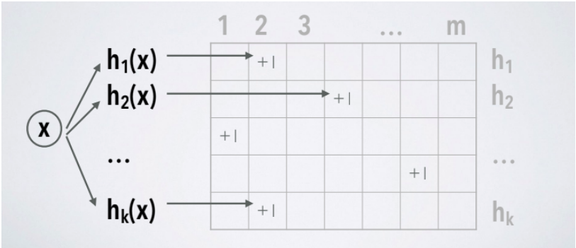
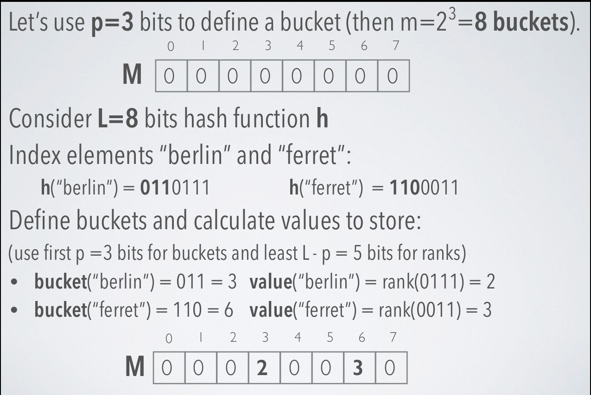
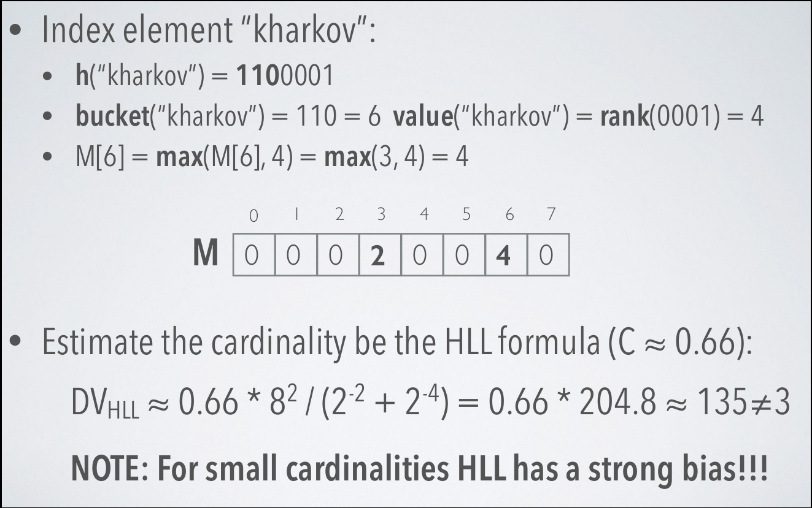
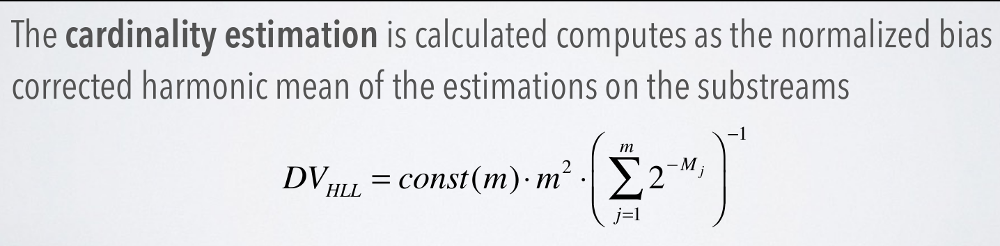
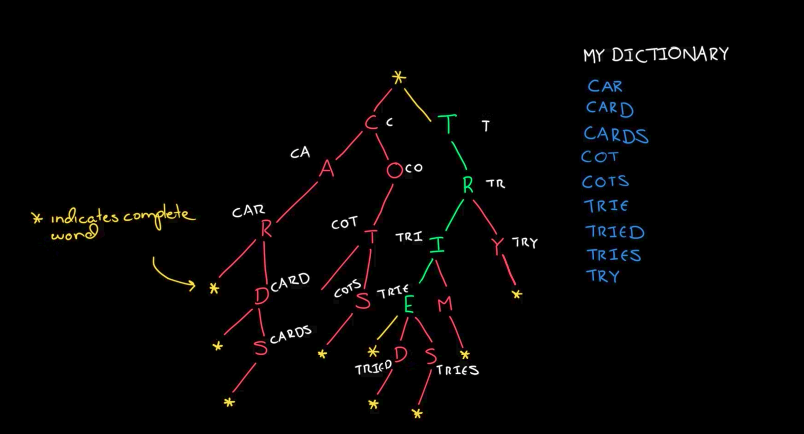

# Probabilistic Data Stucture

## Probabilistic structure là gì ?
- Probabilistic data structure là một nhóm các data structure hữu ích trong việc xử lý big data và streaming. Nhìn chung các cấu trúc dữ liệu này sẽ sử dụng hàm hash để phân loại và thu gọn tập các item. Đụng độ(collisions) thì chúng ta có thể bỏ qua nhưng lỗi sẽ được các thuật toán này handle sao cho chúng luôn dưới ngưỡng cho phép (thresh-hold).PDS sử dụng ít tài nguyên và có thời gian truy vấn là hằng số so với thuật toán error-free.

## Tính chất PDS
Là kiểu thuật toán `xác suất` dựa trên các hàm hash để xác định phần tử có nằm trong tập hợp hay không, đếm tần số của phần tử, hoặc đếm số lượng các phần tử unique trong tập hợp,..
- Có sai số nhất định, nhưng được kiểm soát dưới thresh-hold cho phép -> tỉ lệ sai nhỏ.
- Thời gian tính toán, query là hằng số (không tăng theo số lượng phần tử) -> nhanh, ổn định.
- Dùng ít không gian lưu trữ -> nó không lưu trực tiếp các phần tử mà chỉ lưu dãy bit đại diện.


### Bloom filter 



- Bản chất của bloom filter thực chất là một vector các bit. Một bloom filter rỗng là một vector các bit có giá trị là 0. Ngoài ra, bloom filter còn cần 1 số nhất định các hàm hash với chức năng map một cách ngẫu nhiên và đồng đều các giá trị được add vào bloom filter tới vị trí của 1 bit trong vector. Số lượng các hàm hash và độ dài của bit vector sẽ ảnh hưởng đến độ chính xác khi kết quả của bloom filter là “phần tử đã tồn tại trong tập hợp”. Thường thì số hàm hash (k) là 1 số cố định và nhỏ hơn rất nhiều so với độ dài của bit vector (m).
- Bloom filter chỉ hỗ trợ 2 phương thức là `add` và `test` , trong đó:


    - `ADD` : giúp thêm một phần tử  vào bloom filter và không thể xóa đi được vì nếu xóa sẽ ảnh hưởng tới độ chính xác cần phải kết hợp một số cấu trúc dữ liệu khác để thực hiện thao tác xóa.

    - `TEST` : nhằm kiểm tra xem 1 phần tử có thuộc bloom hay không sẽ có hai trường hợp xảy ra. Nếu là không thì chắc chắn phần tử đó không thể nào thuộc bloom còn nếu có thì sẽ có vấn đề xảy ra đó là false positive xảy ra là do phải `add` quá nhiều phần tử vào bloom đôi khi một vài bit trên bloom cũng dc bật thành 1 và như vậy chính các bit này làm chúng ta nhầm tưởng rằng kết quả trả về là chính xác.

* Khi `add` một phần tử vào bloom nó sẽ được xử lý bởi k hàm hash. k kết quả trả về sẽ là k bit trong bloom vector.

* Khi `test` một phần tử thuộc bloom hay không nó cũng sẽ được check bởi k hàm hash nếu sau đó các bit trả về sẽ được so sánh với bloom vector nếu không có chắc chắn không thuộc nếu có thì có thể là false positive hoặc là thuộc. Các phần tử add vào càng nhiều false positive càng lớn.


Thời gian thực hiện phụ thuộc vào số hàm hash nên : O(k)

### Cuckoo filter 


- Cuckoo Filter là một phiên bản "nâng cấp" cho Bloom Filter khi có thêm chức năng deletion. Mặc dù giống Counting Bloom Filter để cung cấp chức năng insert, delete và lookup nhưng Cuckoo Filter sử dụng cấu trúc dữ liệu và cơ chế insertion khác biệt so vói Bloom Filter.

- Cuckoo Filter bao gồm một bảng Cuckoo hash nơi lưu trữ các fingerprints của các phần tử đã được inserted. Fingerprints của một phần tử là một chuỗi bit bắt nguồn từ giá trị băm của phần tử đó(finger prints là do người viết lập thực chất cũng chỉ là 1 hàm nhưng tùy ỳ mục đích là làm giảm false positive)

- Cuckoo hash table bao gồm một mảng các buckets nơi mà khi một phần tử được thêm vào sẽ được ánh xạ đến 2 buckets dựa vào 2 hàm băm.

Khi 1 phần tử thêm vào các bucket mà tại đó đã có chỗ thì phần tử mới sẽ "kick" phần tử cũ và phần tử cũ sẽ phải đi tìm chỗ mới dựa trên dữ liệu gốc của nó ( thực chất là sau khi bị kick nó là 1 phần tử  được thêm vào như mới và sẽ được duyệt tìm chỗ lại từ đầu ).

* Cấu trúc: 
    * Cuckoo Filter có một bảng *Cuckoo hash* lưu trữ các *fingerprints* của các phần tử đã được *inserted*.

    * *Fingerprints* của một phần tử là một chuỗi bit bắt nguồn từ giá trị băm của phần tử đó.

    * *Cuckoo hash table* bao gồm một mảng các *buckets* nơi mà khi một phần tử được thêm vào sẽ được ánh xạ đến 2 *buckets* dựa vào 2 hàm băm.

    * Thông thường Cuckoo Filter được xác định băng *fingerprint* và *bucket size*

* Để thêm phần tử vào Cuckoo Filter, một phần tử lấy được 2 giá trị *index* từ hàm băm và *fingerprints* của nó. Khi có được các giá trị *index* này, chèn *fingerprints* của nó vào 1 trong 2 *bucket* tương ứng với *index*. Khi *Cuckoo hash table* bắt đầu làm đầy, sẽ có tình huống xảy ra đụng độ. Trong trường hợp này phần tử hiện đang ở trong *hash table* sẽ thay đổi *index* hàm hash hiện tại với *hash* còn lại của nó để có chỗ trống cho phần tử mới vào.

* Để tìm 1 phần tử, có thể tìm theo fingerprint của nó (qua đường dẫn khi được insert vào).

* Để delete 1 phân tử, chỉ cần tra cứu *fingerprints* của phần tử cần xóa ở một trong 2 giá trị *index* (có từ 2 hàm băm) và xóa *fingerprints* đó nếu nó tồn tại.

### Count-Min Sketch ( CM Sketch )


- Count-Min Sketch là một ma trận đơn giản ( set các vùng bằng 0), mỗi hàng sẽ tương ứng với một hàm băm h(i) khác nhau.
Để Thêm phần tử vào bảng Sketch - tính toán k hàm hash rồi cộng dồn ở các vị trí ( ví dụ sau hàm hash trả giá trị bằng 5 và ham hash đang dùng là ham hash thứ 2 thì tại hàng h(2) dòng thứ 5 giá trị tăng lên 1 nhớ CMS đếm số lần xuất hiện hàm hash được gọi tại vị trí i không lưu giá trị hash).

- Sau đó từ giá trị các hàm hash mình chia được thống kê lại tại các vị trí i của mỗi hàm hash giá trị là bao nhiêu chọn số nhỏ nhất trong danh sách đó đó chính count min sketch số lần xuất hiện của phần tử đó trong bảng dữ liệu của chúng ta.

- Thực chất count min sketch trả về tần số cao hơn chứ không nhỏ hơn số lần xuất hiện của phần tử trong mảng. Về cách làm thì count-min sketch gần giống bloom filter khác nhau ở chỗ CMS có thể ước tính được số phần tử được thêm vào nó còn Bloom thì chỉ ghi lại phần tử đó có hay là không.

* CM sketch được mô tả bởi hai tham số: 
    * m: số lượng buckets
    * k: số lượng các hàm băm (thông thường k nhỏ hơn nhiều so với m)
    * Không gian cố định cần thiết: matrix[k,m*k]

[Tham Khảo Count Min Sketch](https://www.youtube.com/watch?v=ibxXO-b14j4)

### Hyper Log Log 
- HyperLoglog là một sự kết hợp giữa data structure và algorithm tương tự như bloom HLL được thiết kế để đếm số unique item trong một tập hợp với độ chính xác rất rất cao. HLL chỉ hỗ trợ việc thêm phần tử và ước lượng số phần tử chứ không lấy ra phần tử cụ thể như Bloom filter nhưng lại có không gian lưu trữ ít hơn so với Bloom.

* Hyperloglog được mô tả bởi 2 tham số:
    * p: số bit xác định một bucket để sử dụng tính trung bình (m=2^p là số lượng buckets/substreams)
    * h: hằm băm, tạo ra các giá trị băm đồng nhất

* HyperLogLog sử dụng randomization để ước tính
cardinality của một multiset. Sự ngẫu nhiên này đạt được bằng cách sử dụng hàm băm h
* Dòng đầu vào của các phần tử dữ liệu S được chia thành m substreams Si bằng cách sử dụng p bits đầu tiên của các giá trị băm (m = 2^p)
* Trong mỗi substream, rank (sau p bits ban đầu được sử dụng cho substreaming) được đo độc lập (rank = số lượng bit 0 đứng đầu +1)
* Những con số này được lưu giữ trong một mảng các thanh ghi M, trong đó M[i] lưu trữ rank tối đa mà nó nhìn thấy cho các dòng với chỉ số i.
* Dùng p bít đầu để tính sẽ lưu value ở ô bucket bao nhiêu dùng các bít còn lại sau p để tính rank và ra được giá trị là value giá trị value này sẽ được add vào bucket.



Trường hợp xảy ra đụng độ sẽ được xử lý bằng cách lấy max của 2 giá trị đang xảy ra tranh chấp.và sau đó tính toán lại xem có bao nhiêu unique item dựa theo hình sau :




Công thức chung để dm961 unique item là :





### Trie 



- Trie hay còn gọi là Prefix tree, là một cấu trúc dữ liệu dạng tree với root là một chuỗi rỗng dùng để lưu tập hợp của các chuỗi, nếu 2 chuỗi có cùng prefix thì nó sẽ có cùng các node cha.

Trong trường hợp bạn có rất nhiều chuỗi thì Trie là một cấu trúc rất dễ cho việc kiểm tra xem chuỗi đó có tồn tại trong data của bạn hay không. Trie cũng được dùng nhiều cho việc tìm kiếm prefix của chuỗi. Khi sử dụng Trie, độ phức tạp khi tìm kiếm được tối ưu đến mức bằng với độ dài của key ta muốn tìm kiếm.

* Trie cho phép:
    * Thêm một xâu vào tập hợp
    * Xóa một xâu khỏi tập hợp
    * Kiểm tra một xâu có tồn tại trong tập hợp hay không.

* ví dụ một cấu trúc của TrieNode:
    ``` java
    TrieNode {
        map <Chacracter, ChildNode> children;
            boolean endOfWord;
    }
    ```
* Mỗi Trie node sẽ chứa 2 components chính:
    * map: chứa key là character và value là child node, dùng để khởi tạo mối quan hệ giữa node cha và node con.
    * boolean endOfWord dùng để kiểm tra child node hiện tại có phải là character cuối cùng của key hay không.

* Ưu điểm:
    * Cài đặt đơn giản, dễ nhớ
    * Tiết kiệm bộ nhớ: Khi số lượng khóa lớn và các khóa có độ dài nhỏ, thông thường trie tiết kiệm bộ nhớ hơn do các phần đầu giống nhau của các khoá chỉ được lưu 1 lần. Ưu điểm này có ứng dụng rất lớn, chẳng hạn trong từ điển.
    * Thao tác tìm kiếm: O(m) với m là độ dài khóa.
    * Số lượng nút từ gốc tới lá đúng bằng độ dài của khóa.
* Công dụng
    * Dựa vào tính chất của cây trie, có thể thực hiện một số liên quan đến thứ tự từ điển như sắp xếp, tìm một khóa có thứ tự từ điển nhỏ nhất và lớn hơn một khóa cho trước... và một số thao tác liên quan đến tiền tố, hậu tố.
    * Trong trường hợp có rất nhiều chuỗi thì Trie là một cấu trúc rất dễ cho việc kiểm tra xem chuỗi đó có tồn tại trong data của bạn hay không. Trie cũng được dùng nhiều cho việc tìm kiếm prefix của chuỗi. Khi sử dụng Trie, độ phức tạp khi tìm kiếm được tối ưu đến mức bằng với độ dài của key ta muốn tìm kiếm.


# Design Pattern 

- Design patterns là một kỹ thuật trong lập trình hướng đối tượng, được các nhà nghiên cứu đúc kết và tạo ra các mẫu thiết kế chuẩn. Và design pattern không phải là một ngôn ngữ lập trình cụ thể nào cả, mà nó có thể sự dụng được trong hầu hết các ngôn lập trình có hỗ trợ OOP hiện nay.


## Dependence Injection 

- Dependency Injection nghĩa là các đối tượng (object) sẽ không cần quan tâm đến việc khởi tạo hay get các phụ thuộc (dependency) của mình, thay vào đó, sẽ có một bên thứ 3 đứng ra, tiêm (inject) các dependency này vào đối tượng.

- Các module không giao tiếp trực tiếp với nhau, mà thông qua interface. Module cấp thấp sẽ implement interface, module cấp cao sẽ gọi module cấp thấp thông qua interface.

Ví dụ: Để giao tiếp với database, ta có interface IDatabase, các module cấp thấp là XMLDatabase, SQLDatabase. Module cấp cao là CustomerBusiness sẽ chỉ sử dụng interface IDatabase.

- Việc khởi tạo các module cấp thấp sẽ do DI Container thực hiện. Ví dụ: Trong module CustomerBusiness, ta sẽ không khởi tạo IDatabase db = new XMLDatabase(), việc này sẽ do DI Container thực hiện. Module CustomerBusiness sẽ không biết gì về module XMLDatabase hay SQLDatabase.

- Việc Module nào gắn với interface nào sẽ được config trong code hoặc trong file XML.

DI được dùng để làm giảm sự phụ thuộc giữa các module, dễ dàng hơn trong việc thay đổi module, bảo trì code và testing.

- Dĩ nhiên, DI không phải vạn năng, nó cũng có những ưu điểm và khuyết điểm, do đó không phải project nào cũng nên áp dụng DI. Với những dự án lớn, code nhiều, DI là thứ rất cần thiết để đảm bảo code dễ bảo trì, dễ thay đổi. Vì vậy, bản thân các framework nổi tiếng như Spring, Struts2, ASP.NET MVC, … đều hỗ trợ hoặc tích hợp sẵn DI. ASP.NET MVC từ bản 5 trở xuống cho phép ta sử dụng DI container từ thư viện, từ bản 6 thì tích hợp sẵn DI luôn, không cần phải thêm thư viện gì.

- Ưu điểm :
    - Giảm sự kết dính giữa các module.
    - Code dễ bảo trì, dễ thay thế module.
    - Rất dễ test và viết Unit Test.
    - Dễ dàng thấy quan hệ giữa các module (Vì các dependecy đều được inject vào constructor).

- Khuyết điểm : 
    - Khái niệm DI khá "khó tiêu", các developer mới sẽ gặp khó khăn khi học.
    - Sử dụng interface nên đôi khi sẽ khó debug, do không biết chính xác module nào được gọi.
    - Các object được khởi tạo toàn bộ ngay từ đầu, có thể làm giảm performance.
    - Làm tăng độ phức tạp của code.


#### Note 
- Dependency là đối tượng được sử dụng trong một object.
- Injection có nghĩa là khả năng thay thế dependency nói trên bằng một đối tượng tùy ý khác.
- Các cách tim dependency vào :
    - *Constructor Injection* : Các dependency sẽ được container truyền vào (inject vào) 1 class thông qua constructor của class đó. Đây là cách thông dụng nhất.

    - *Setter Injection* : Các dependency sẽ được truyền vào 1 class thông qua các hàm Setter.

    - *Interface Injection* : Class cần inject sẽ implement 1 interface. Interface này chứa 1 hàm tên Inject. Container sẽ injection dependency vào 1 class thông qua việc gọi hàm Inject của interface đó. Đây là cách rườm rà và ít được sử dụng nhất.

DI Container là gì ? Nói đơn giản khi tim các dependecy vào mỗi lần module cấp cao được thực hiện thì nó sẽ gọi lại các module cấp thấp hết lần này tới lần khác DI con tainer giúp giải quyết việc này.DI container sẽ inject các module cấp thấp vào module cấp cao.Sau khi áp dụng Dependency Injection, code bạn sẽ dài hơn, có vẻ “phức tạp” hơn và sẽ khó debug hơn. Đổi lại, code sẽ uyển chuyển, dễ thay đổi cũng như dễ test hơn.

``` java
    // tạo interface Vehicle.java 
    public interface Vehicle {
        void move();
    }

    // tạo concrete class Car.java
    public class Car implements Vehicle {
        @Override
        void move() {
            System.out.prinln("Move by Car");
        }
    }

    // tạo concrete class Train.java 
    public class Train implements Vehicle {
        @Override
        void move() {
            System.out.prinln("Move by Train");
        }
    }

    // Tạo class Travel quản lý các đối tượng Vehicle
    public clas Travel {
        Vehicle v;
        
        public Travel(Vehicle v) {
            this.v = v;
        }

        void startJourney() {
            v.move();
        }
    }
```

DI Container :
```java
    // Với mỗi Interface, ta define một Module tương ứng
DIContainer.SetModule<IDatabase, Database>();
DIContainer.SetModule<ILogger, Logger>();
DIContainer.SetModule<IEmailSender, EmailSender>();
 
DIContainer.SetModule<Cart, Cart>();
 
    //DI Container sẽ tự inject Database, Logger vào Cart
var myCart = DIContainer.GetModule(); 
 
    //Khi cần thay đổi, ta chỉ cần sửa code define
DIContainer.SetModule<IDatabase, XMLDatabase>();

```


## Factory

- Factory pattern là một trong nhưng mẫu design pattern được sử dụng nhiều nhất đặc biệt là trong java. Factory thuộc mẫu `creational` mẫu này cung cấp một trong những cách tốt nhất để tạo đối tượng.
- Trong factory khi tạo ra một object mới chúng ta sẽ không để lộ các logic khởi tạo bên trong mà chúng được tham chiếu tới các interface chung.

Cách cài đặt :

FactoryPatternDemo sẽ dùng class ShapeFactory để lấy một Shape object bất kỳ nó sẽ bỏ qua thông tin có hình gì ( RECTANGLE/ SQUARE / CIRCLE ) mà nó sẽ `ask` ShapeFactory để get shape mà nó muốn.


- Bước 1 : Tạo interface
```java
public interface Shape {
   void draw();
}
```
- Bước 2 : Khai báo các class xử lý cụ thể và implement `interface` vừa tạo vào các class này.


Rectangle.java
```
public class Rectangle implements Shape {

   @Override
   public void draw() {
      System.out.println("Inside Rectangle::draw() method.");
   }
}
```
Square.java
```
public class Square implements Shape {

   @Override
   public void draw() {
      System.out.println("Inside Square::draw() method.");
   }
}
```
Circle.java
```
public class Circle implements Shape {

   @Override
   public void draw() {
      System.out.println("Inside Circle::draw() method.");
   }
}
```

- Bước 3 : Tạo Factory để tạo ra các `concrete` class dựa trên các thông tin đã cho trước.

ShapeFactory.java

```java
public class ShapeFactory {
	
   //use getShape method to get object of type shape 

   public Shape getShape(String shapeType){
      if(shapeType == null){
         return null;
      }		
      if(shapeType.equalsIgnoreCase("CIRCLE")){
         return new Circle();
         
      } else if(shapeType.equalsIgnoreCase("RECTANGLE")){
         return new Rectangle();
         
      } else if(shapeType.equalsIgnoreCase("SQUARE")){
         return new Square();
      }
      
      return null;
   }
}
```

- Bước 4 : FactoryPatternDemo sẽ hỏi Factory để lấy thông tin mà nó muốn mục đích là che dấu logic khởi tạo bên dưới chúng ta chỉ nhìn thấy tại hàm `main` các phương thức khởi tạo chứ không biết các Shape được tạo ở đâu và như thế nào.

FactoryPatternDemo.java
```java
public class FactoryPatternDemo {

   public static void main(String[] args) {
      ShapeFactory shapeFactory = new ShapeFactory();

      //get an object of Circle and call its draw method.
      Shape shape1 = shapeFactory.getShape("CIRCLE");

      //call draw method of Circle
      shape1.draw();

      //get an object of Rectangle and call its draw method.
      Shape shape2 = shapeFactory.getShape("RECTANGLE");

      //call draw method of Rectangle
      shape2.draw();

      //get an object of Square and call its draw method.
      Shape shape3 = shapeFactory.getShape("SQUARE");

      //call draw method of square
      shape3.draw();
   }
}
```

Khi nào dùng Factory Pattern ?

- Tạo ra 1 cách mới trong việc khởi tạo Object => Hiển nhiên.

- Che giấu xử lý logic của việc khởi tạo => Trong trường hợp bạn đang muốn viết 1 thư viện để người khác sử dụng.

- Giảm sự phụ thuộc => Dễ dàng cho việc mở rộng trong trường hợp bạn chưa biết chắc số lượng đối tượng (Square, Circle, Rectangle) là đã đủ cho bài toán của mình chưa. Vì khi bạn thêm vào thì phía trên ( class FactoyPatternDemo )không cần phải sửa gì thêm, chỉ là thay đổi ở phía dưới thôi 😉.


## Singleton

- Singleton Pattern là một trong những design pattern đơn giản nhất được tạo ra nhằm cung cấp việc tạo một object.Pattern này liên quan tới một class có nhiệm vụ tạo ra một object và đảm bảo rằng chỉ có mọt object được tạo ra. Class này cung cấp một phương pháp để truy nhập vào object duy nhất của nó đó là access trực tiếp mà không cần phải tạo instance của class.

- Pattern này chỉ cho phép một Class chỉ có một đối tượng duy nhất, và nó được truy cập trực tiếp thông qua tên Class (biến static) và không có constructor cho Class đó.

- Bước 1 : Tạo Singleton class

```java
public class SingleObject {

   //create an object of SingleObject
   private static SingleObject instance = new SingleObject();

   //make the constructor private so that this class cannot be
   //instantiated
   private SingleObject(){}

   //Get the only object available
   public static SingleObject getInstance(){
      return instance;
   }

   public void showMessage(){
      System.out.println("Hello World!");
   }
}
```

Bước 2 : Cho SingleTonPatternDemo nhận object duy nhất từ SingleTon 

```java
public class SingletonPatternDemo {
   public static void main(String[] args) {

      //illegal construct
      //Compile Time Error: The constructor SingleObject() is not visible
      //SingleObject object = new SingleObject();

      //Get the only object available
      SingleObject object = SingleObject.getInstance();

      //show the message
      object.showMessage();
   }
}
```

Thực chất mục đích của Singleton là ngăn việc tạo ra quá nhiều các object làm tiêu tốn tài nguyên nên đã tạo ra singleton với các thực thi là mỗi khi `new` một đối tượng thì ví hàm constructor đã là private nên nó sẽ không chạy mà không chạy thì đối tượng không tạo ra chúng ta tạo ra các instance để nếu chưa tạo thì đối tượng được tạo nếu được tao mỗi lần cần tạo mới thì nó sẽ lại trỏ về đối tượng đã được tạo cửa chúng ta.


## Builder 
- Builder pattern là một mẫu thiết kế thuộc "Nhóm khởi tạo" (Creational Pattern). Mẫu thiết kế này cho phép lập trình viên tạo ra những đối tượng phức tạp nhưng chỉ cần thông qua các câu lệnh đơn giản để tác động đến các thuộc tính của nó.
- Thực chất builder pattern tạo ra một đối tượng ' cao cấp ' bằng cách gọi các đối tượng cấp thấp hơn để tạo nên đối tượng cấp cao này vì có quá nhiều đối tượng được gọi nên 'phức tạp' còn việc tạo một đối tượng cấp thấp thì đơn giản.

* Xét ví dụ tại một cửa hàng fast food chúng ta có order cơ bản của thực khách là gọi đồ ăn là chay 'VegMeal' hoặc 'Non-VegMeal' trong đó mỗi phần ăn sẽ có 'burger' và 'drink' 'burger' sẽ được bọc lại vào giấy còn 'drink' sẽ có 'Coca' và 'Pepsi' và sẽ được đựng vào ly.

- Bước 1 : tạo các interface đại diện cho 'Item food' và 'packing'
Item.java

```java
// Một item sẽ có tên món hàng, gói lại và đưa ra giá.
public interface Item {
   public String name();
   public Packing packing();
   public float price();	
}
```
Packing.java

```java
public interface Packing {
   public String pack();
}
```

- Bước 2 : Tạo class `concrete` để implement interface Packing

Wrapper.java
```java
public class Wrapper implements Packing {

   @Override
   public String pack() {
      return "Wrapper";
   }
}
```
Bottle.java
```java
public class Bottle implements Packing {

   @Override
   public String pack() {
      return "Bottle";
   }
}
```

- Bước 3 : Tạo các lớp trừu tượng triển khai interface các hàm của Interface mục đích là vì chưa rò là loại thức ăn đươc order là thức ăn Veg hay Non-veg vì thế phải viết abstarct xuống tới từng hàm riêng của Veg và Non-veg sẽ định nghĩa lại các hàm này.

Burger.java
```java
public abstract class Burger implements Item {

   @Override
   public Packing packing() {
      return new Wrapper();
   }

   @Override
   public abstract float price();
}
```
ColdDrink.java
```java
public abstract class ColdDrink implements Item {

	@Override
	public Packing packing() {
       return new Bottle();
	}

	@Override
	public abstract float price();
}
```

- Bước 4 : Bắt tay vào định nghĩa các class extending concrete tức là viết các class cụ thể cho các item và các service.

VegBurger.java
```java
public class VegBurger extends Burger {

   @Override
   public float price() {
      return 25.0f;
   }

   @Override
   public String name() {
      return "Veg Burger";
   }
}
```
ChickenBurger.java
```java
public class ChickenBurger extends Burger {

   @Override
   public float price() {
      return 50.5f;
   }

   @Override
   public String name() {
      return "Chicken Burger";
   }
}
```
Coke.java
```java
public class Coke extends ColdDrink {

   @Override
   public float price() {
      return 30.0f;
   }

   @Override
   public String name() {
      return "Coke";
   }
}
```
Pepsi.java
```java
public class Pepsi extends ColdDrink {

   @Override
   public float price() {
      return 35.0f;
   }

   @Override
   public String name() {
      return "Pepsi";
   }
}
```
- Bước 5 : gọi hàm meal để đưa chứa các object đã được định nghĩa.

Meal.java
```java
import java.util.ArrayList;
import java.util.List;

public class Meal {
   private List<Item> items = new ArrayList<Item>();	

   public void addItem(Item item){
      items.add(item);
   }

   public float getCost(){
      float cost = 0.0f;
      
      for (Item item : items) {
         cost += item.price();
      }		
      return cost;
   }

   public void showItems(){
   
      for (Item item : items) {
         System.out.print("Item : " + item.name());
         System.out.print(", Packing : " + item.packing().pack());
         System.out.println(", Price : " + item.price());
      }		
   }	
}
```

- Bước 6 : gọi MealBuilder để thực hiện theo order bữa ăn 

MealBuilder.java

```java
public class MealBuilder {

   public Meal prepareVegMeal (){
      Meal meal = new Meal();
      meal.addItem(new VegBurger());
      meal.addItem(new Coke());
      return meal;
   }   

   public Meal prepareNonVegMeal (){
      Meal meal = new Meal();
      meal.addItem(new ChickenBurger());
      meal.addItem(new Pepsi());
      return meal;
   }
}
```

- Bước 7 : Tạo MealBuilderPattern để testing khả năng làm việc của Meal.

BuilderPatternDemo.java

```java
public class BuilderPatternDemo {
   public static void main(String[] args) {
   
      MealBuilder mealBuilder = new MealBuilder();

      Meal vegMeal = mealBuilder.prepareVegMeal();
      System.out.println("Veg Meal");
      vegMeal.showItems();
      System.out.println("Total Cost: " + vegMeal.getCost());

      Meal nonVegMeal = mealBuilder.prepareNonVegMeal();
      System.out.println("\n\nNon-Veg Meal");
      nonVegMeal.showItems();
      System.out.println("Total Cost: " + nonVegMeal.getCost());
   }
}
```


Link Tham Khảo :

[Tutorials-Point](https://www.tutorialspoint.com/design_pattern/)