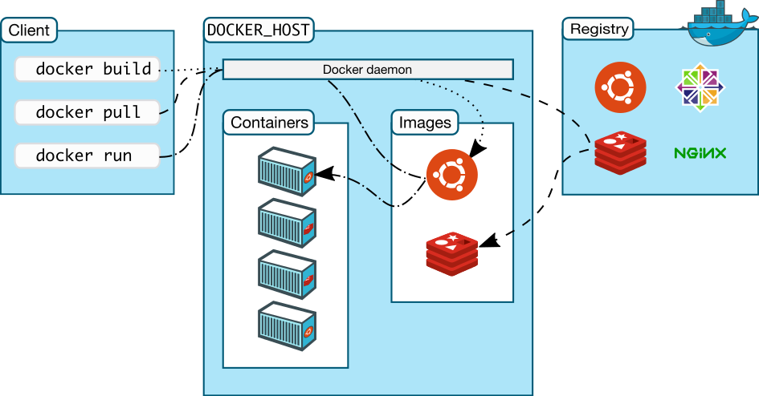

# Tìm hiểu về DOCKER

Docker là gì?

- Docker là một open platform cung cấp cho người sử dụng những công cụ và service để người sử dụng có thể đóng gói và chạy chương trình của mình trên các môi trường khác nhau một cách nhanh nhất.

- Còn theo ý hiểu đơn thuần của mình khi sử dụng, thì docker đóng gói và cài đặt môi trường cho chương trình rất là nhanh. Giả sử như trước đây mình cần setup một môi trường cho hệ thống yêu cầu phải dùng cùng lúc 4 loại database mongo, postgresql, redis, mysql, thay vì phải cài và chạy cho từng con, mình chỉ cần chạy một lệnh docker-compose up vậy là xong =)).

Một Docker thường có 4 thành phần cơ bản :

- Image
- Container
- Docker Engine
- Docker Hub

Image là file ảnh, file nền của một hệ điều hành, một nền tảng, một ngôn ngữ (vd: ubuntu image, ruby image, rails image, mysql image…).Từ các image này, bạn sẽ dùng nó để tạo ra các container.Các image là dạng file-chỉ-đọc (read only file).Tự bạn cũng có thể tạo image cho riêng mình.Một image có thể được tạo từ nhiều image khác (vd: bạn tạo 1 image chạy ubuntu, có cài sẵn ruby 2.3 và rails 5, image này của bạn được tạo nên bởi 3 image khác).

Container Là một máy ảo, được cấu thành từ 1 image và được đắp thêm 1 lớp “trang trí” writable-file-layer. Các thay đổi trong máy ảo này (cài thêm phần mềm, tạo thêm file…) sẽ được lưu ở lớp trang trí này.

Các container này sẽ dùng chung tài nguyên của hệ thống (RAM, Disk, Network…), chính nhờ vậy, những container của bạn sẽ rất nhẹ, việc khởi động, kết nối, tương tác sẽ rất nhanh gọn.

Nếu ánh xạ sang hướng đối tượng, thì image chính là class, còn container chính là instance-1 thể hiện của class đó. Từ 1 class ta có thể tạo ra nhiều instance, tương tự, từ 1 image ta cũng có thể tạo ra được nhiều container hoàn toàn giống nhau.

Docker Engine quản lý việc bạn tạo image, chạy container, dùng image có sẵn hay tải image chưa có về, kết nối vào container, thêm, sửa, xóa image và container, ....., vô vàn vô vàn

Docker Hub Là 1 trang chia sẻ các image, nó như kiểu github hay bitbucket vậy.

