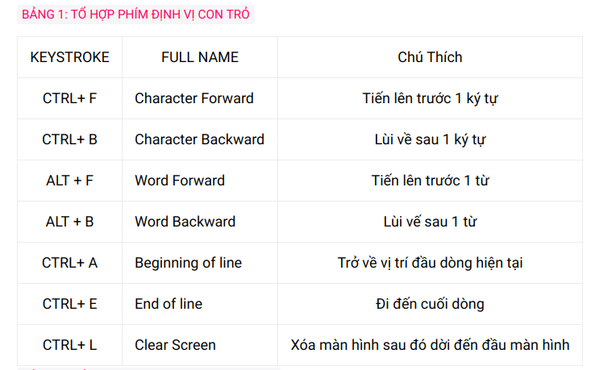

# Linux Shell

Shell là một chương trình dịch từ mã code của người dùng thành mã máy.

Có rất nhiều shell khác nhau shell gốc ban đầu là sh các shell sau này như bash, zsh là dựa trên shell sh sau đó thêm các tính năng khác.

Oh my zsh : thực chất là một framework của zsh nhằm giúp lập trình viên giảm thiểu số dòng lệnh phải gõ

Vim : là trình soạn thảo và chỉnh sửa văn bản trên linux

Bash Script : là một tập hợp các tập hợp các câu lệnh được biên soạn trước nhằm phục vụ tự động hóa cho một công việc nào đó.
## Một Số Lệnh Khi Thao Tác Với Shell :


- pwd - In thư mục hiện tại

- cd - Chuyển đến thư mục khác

- ls - Hiển thị nội dung thư mục 
mkdir - Tạo một thư mục
Cú pháp: mkdir dir1 dir2 dir3

- cp - Sao chép files và thư mục 
Cú pháp: cp item1 item2

- mv - Di chuyển và đổi tên files

- rm - Xóa files và thư mục

- ln - Taọ liên kết


Hard-link:
- Cú pháp: ln file link
Liên kết cứng là liên kết trong cùng một hệ thống tập tin với hai node entry tương ứng cùng trỏ đến cùng một nội dung vật lý.
- Khi xóa file gốc, vùng dữ liệu không bị mất đi vì còn file liên kết cứng.
Không liên kết được với thư mục.


Symbolic link:

Cú pháp: ln -s file link
- Liên kết mềm là liên kết không dùng đến node entry mà chỉ đơn thuần là một shortcut.
Khi xóa file gốc thì vùng dữ liệu bị mất đi.


- cat - Đọc và in nội dung file ra màn hình

- touch - Tạo một file mới

- echo - In thông tin của tham số truyền vào ra màn hình

- clear - Xóa màn hình

- history - In ra màn hình các câu lệnh đã sử dụng trước đó

- chmod - Thay đổi thuộc tính của file ( khả năng đọc, viết, thực thi, ...)

- sudo - Thực thi một câu lênh với quyền quản trị

- ps - Liệt kê tất cả các process đang chạy

- kill - Tắt một process với PID được cung cấp

Để biết thông tin cụ thể của một lệnh nào đó, command --help

## Một số thao tác sử dụng trong terminal :




## Exercises

# 4.1 Processing Text
Count the number of lines satisfying a specific pattern in a log file :
```
cat <log file> 
### đọc và hiển thị nội dung cua log file lên terminal

grep <Pattern> <log file> -wc 
grep -wc <Pattern> <log file>
### pattern là đoạn mẫu muốn tìm trong file log
```

Calculate KLOC of C/C++ code 

```
find -name *.c / *.cpp /*.h 
### Lệnh find để  list ra tất cả các file có chứa code C/C++ .

wc -l *.cpp / *.c /*.h
### lệnh để in ra tất cả các dòng lệnh có trong các file code C/C++ in ra dòng lệnh từng file sau đó sẽ cộng tất cả lại
```

# 4.2 System 
-  Kill multiple processes following a patterns :
Cách nhanh nhất dùng lệnh 
```
killall <tên process > 
```
là có thể tắt tất cả quá trình 

hoặc 
```
#ps aux | grep firefox | awk '{print $2'| xargs kill
```
gõ liên tiếp các lệnh không gõ riêng từng lệnh để tắt firefox

- Kill processes opening a specific port (using `netstat`, `grep`...) :

kill -9 $(lsof -t -i:<port>)

- List opennned ports, handles :
sudo netstat -ptau.
sudo netstat -tulnp.
 -Trong đó : 
   + ptau : 
        - p : PID tương ứng
        - t : TCP 
        - u : UDP 
        - a : các socket đang nghe
   + tulpn
        - t : TCP
        - u : UDP
        - l : danh sách các socket đang lắng nghe
        - p : chương trình sử dụng các cổng đó
        - n : số  cho địa chỉ local của các chương trình sử dụng các port đó.

- List, one at a time, all files larger than 100K in the /home/username directory tree. Give the user the option to delete or compress the file, then proceed to show the next one. Write to a logfile the names of all deleted files and the deletion times.

```
#!/bin/sh
myArr = $(sudo find $HOME -type f -size +100k)
for ele in $myArr[*]
do
	echo "FILE NAME: "
	echo $ele
	echo "1. DELETE	"
	echo "2. COMPRESS "
	echo "3. SKIP "
	echo "4. EXIT "
	echo "YOUR CHOICE  "
	read choose
	
	case $choose in
	1)
	rm $ele
  
	time=`date +"[%d/%b/%Y:%k:%M:%S %z]"`

	printf "File name: %s - Time: %s\n" 
  
  $ele $time >> log.txt
	;;
	2)
	tar -cvzf $ele.tar.gz $ele
	;;
	3)
	continue
	;;
	4)
	break
	;;
	*)
	echo "FAULTS "

	esac
done

```

Sau đó tại terminal gõ các dòng lệnh sau để tiền hành chạy file 
```
- cd ~
- sudo find . -type f -size +100k
```
