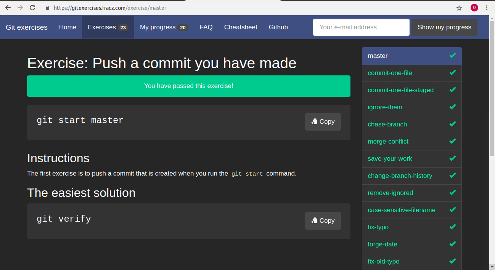
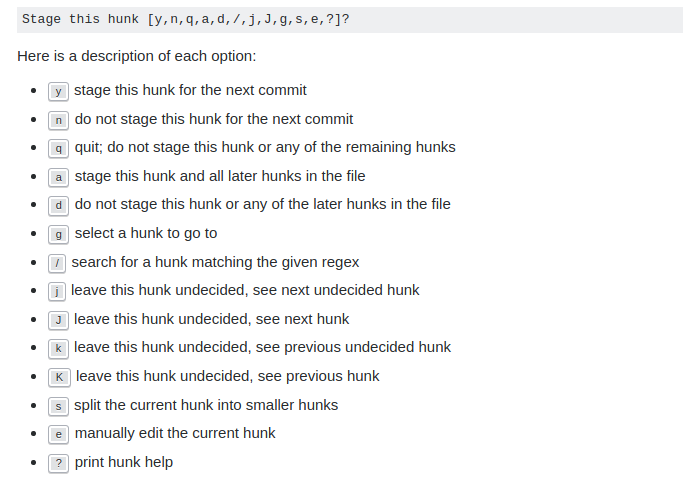

# Cách dùng một số lệnh commit, push, ,pull, merge, create branch, checkout :

 ## Bảng cheat sheet các lệnh cơ bản sử dụng trong git :

[Basic Commandline](https://services.github.com/on-demand/downloads/github-git-cheat-sheet.pdf)


- `add` dùng để  đánh dấu stage để chuẩn bị commit vào local repository :
```
$ git add demo.cpp
```

- `commit` dùng để  đẩy File mà đã được đánh dấu staged trước đây nhờ vào lệnh add để đưa vào local repository.
-m để chú thích về lần commit
```
$ git commit -m "add demo.cpp"
```


Lệnh push dùng để cập nhật sự thay đổi của lần commit đó lên repository của GIT , <branch> là nhánh dùng để push lên, ví dụ  master
```
$ git push origin <branch>
```

[Overview-add-commit-push](https://help.github.com/articles/adding-a-file-to-a-repository-using-the-command-line/)


### Tham gia khóa test online tại : https://gitexercises.fracz.com/

- Email tham gia : vqdat96@gmail.com
- Ảnh dardboard : 

- Một số thông tin liên quan trong quá trình làm bài :


